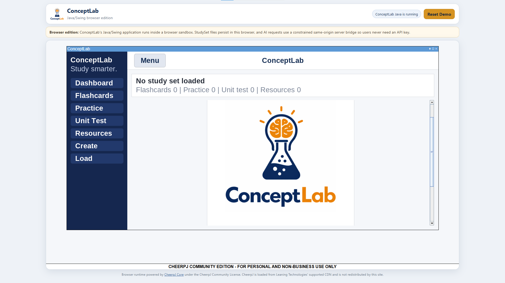

<p align="center">
  
</p>

<p align="center">
  <strong>A Java study platform I built to turn source material into application-focused practice, feedback, and reusable StudySets.</strong>
</p>

<p align="center">
  Java · Swing/AWT · CheerpJ · Java HTTP Client · Groq API · Vercel · local file persistence
</p>

<p align="center">
  Used or tested by <strong>60+ people</strong> during development
</p>

<p align="center">
  <a href="https://conceptlab-browser.vercel.app"><strong>Run ConceptLab in Browser</strong></a>
</p>

<p align="center">
  <a href="https://github.com/kzhu37/ConceptLab.Java-Portfolio/actions/workflows/verify-and-capture.yml"></a>
  <a href="https://github.com/kzhu37/ConceptLab.Java-Portfolio/actions/workflows/production-browser-smoke.yml"></a>
</p>

<table>
  <tr>
    <td width="50%">
      
    </td>
    <td width="50%">
      
    </td>
  </tr>
  <tr>
    <td align="center"><sub>A loaded StudySet connects flashcards, practice, unit testing, resources, and saved progress.</sub></td>
    <td align="center"><sub>The public browser edition runs the Java/Swing application through CheerpJ with persistent StudySets and a server-side AI boundary.</sub></td>
  </tr>
</table>

## Why I built it

ConceptLab began with a learning problem I kept seeing: reviewing notes and recognizing definitions did not guarantee that someone could apply a concept when the context changed.

I built the product around that gap. A StudySet combines source material, fresh practice, unit testing, feedback, related resources, and saved progress in one repeatable workflow. The design principle is simple: **application matters more than memorization alone, and a mistake should lead to the next useful learning step.**

That principle shaped the engineering too. Fresh practice should not collapse into near-duplicate prompts. Generated output should not become application data just because an API returned it. Reliability, validation, and useful failure behavior are part of the product.

## What makes the project technically interesting

| Area | Implementation |
| --- | --- |
| **Guarded generation** | Structured contracts, parsing, domain validation, batching, retries, token budgeting, duplicate filtering, provider failover, and deterministic local fallbacks. |
| **Learning rules in the data model** | Practice and unit-test banks remain disjoint by normalized prompt, and `Question` objects reject invalid response modes, MCQ structure, answer indices, choice duplication, and out-of-range difficulty. |
| **Local-first persistence** | Versioned `.clab` StudySets store durable content without a database, while escaping and count checks protect round-trip integrity. |
| **Desktop to browser** | The Java/Swing application is adapted into a Java 17 CheerpJ artifact instead of being replaced with a separate web implementation. |
| **Public AI boundary** | The browser calls a same-origin Vercel function that keeps credentials server-side and restricts task shapes, models, prompt size, output schemas, request rate, and provider responses. |
| **Verification** | GitHub Actions compile and test the desktop app, rebuild the browser artifact, inspect credential exposure, reproduce UI captures, and smoke-test the deployed browser workflow. |

## Engineering highlights

### 1. Building a reliable system around an unreliable generator

Calling a model was the easy part. The harder problem was deciding when generated content was trustworthy enough to become real application data.

ConceptLab requests task-specific structured output, parses it, validates its shape, converts valid records into domain objects, filters malformed or repeated items, and only then admits them into a StudySet. Larger question requests are divided into bounded batches, source material is chunked, output budgets account for prompt size, and truncated responses are treated as failures instead of partial success.

The generation layer also supports primary and fallback models, optional credential failover, retry handling for transient provider failures, duplicate protection, and deterministic local fallbacks for core study flows.


The orchestration lives primarily in [`Main.java`](Main.java). Durable invariants are enforced by [`StudySet.java`](StudySet.java), [`Question.java`](Question.java), [`Flashcard.java`](Flashcard.java), [`ResourceLink.java`](ResourceLink.java), and [`EscapeUtil.java`](EscapeUtil.java).

**The important shift was treating generated output as untrusted external data, not as a trusted internal return value.**

### 2. Turning the learning goal into data rules

ConceptLab biases practice toward computation, inference, interpretation, method selection, error diagnosis, and explanation rather than repeated definition recall.

That product goal is enforced below the prompt layer. `StudySet` prevents duplicate IDs and normalized duplicate prompts, and it keeps practice and unit-test banks disjoint. `Question` validates response type, MCQ choice structure, choice uniqueness, answer indices, difficulty, and stable identity at construction time.

The connection is deliberate: if the goal is transfer, a technically valid but nearly repeated question is still a weak result.

### 3. Choosing local persistence instead of unnecessary infrastructure

ConceptLab stores desktop StudySets under the user's home directory in a versioned `.clab` format. The file records metadata, flashcards, practice questions, unit-test questions, resources, and the best unit-test score.

Each collection section declares its expected count, and loading checks those counts against the records that were actually parsed. Older question-record formats remain readable after the question model evolved. Because user-authored content can contain pipes, backslashes, and newlines, [`EscapeUtil.java`](EscapeUtil.java) explicitly escapes and restores reserved characters so content can round-trip without corrupting record boundaries.

I chose this local-first design because the core product did not need a hosted database. It kept setup smaller while still forcing careful decisions about format versioning, validation, backward compatibility, and corruption handling.

## Browser edition

ConceptLab started as a Java/Swing desktop application. For the public demo, I wanted immediate access without requiring Java installation or asking users to enter an API key, but I did not want to replace the project with a look-alike web rewrite.

The browser build therefore keeps the desktop Java sources authoritative. [`browser/build-browser.py`](browser/build-browser.py) copies those sources into an isolated build directory, applies a small set of exact-match browser adaptations, compiles Java 17 bytecode, and packages the artifact for **CheerpJ Core 4.3**. If an expected source boundary changes, the build fails instead of silently applying a mismatched patch.

The browser architecture adds three explicit boundaries:

1. **Runtime:** CheerpJ executes the Java/Swing application in the browser.
2. **Persistence:** StudySets use CheerpJ's persistent `/files` filesystem, with a resettable Newtonian Mechanics demo seeded for first-time use.
3. **AI security:** browser generation goes through [`api/conceptlab/ai.js`](api/conceptlab/ai.js), which keeps Groq credentials server-side and accepts only ConceptLab's constrained request contracts.

> **Browser demo note:** This demo runs the Java/Swing ConceptLab application inside a browser sandbox through CheerpJ. It is a public adaptation of the desktop code, not a separate web implementation, and browser-specific transport and storage behavior are added only at explicit boundaries.

<p align="center">
  <a href="https://conceptlab-browser.vercel.app"><strong>Open the live browser edition</strong></a>
</p>

## Product workflow

### Build a StudySet from source material

A StudySet begins with the user's own material. The creation flow can also include learning goals, custom instructions, target difficulty, flashcard count, and challenge-style material.

<table>
  <tr>
    <td width="50%">
      
    </td>
    <td width="50%">
      
    </td>
  </tr>
  <tr>
    <td align="center"><sub>Source material, goals, and instructions define what the StudySet should teach.</sub></td>
    <td align="center"><sub>Practice settings feed directly into generation constraints and duplicate handling.</sub></td>
  </tr>
</table>

The system can build flashcards, a broader unit-test bank, related learning resources, and fresh practice generated on demand.

### Make practice configurable

Users can change question count, difficulty, response style, challenge level, whether previously seen prompts should be avoided, and whether correct-answer text should remain unique. These controls are not cosmetic. They influence prompt construction, generation constraints, duplicate filtering, and the resulting `Question` objects.

### Turn mistakes into the next step

A submitted response can lead to correctness feedback, an explanation, a related resource, and related flashcards. Questions with known answer keys retain deterministic checking paths when remote grading is unavailable.

<p align="center">
  
</p>
<p align="center">
  <sub>Feedback is designed to connect an error to explanation and review, not only to mark it wrong.</sub>
</p>

## Decisions and iteration

The project improved most when I stopped treating more features as the same thing as progress.

| Challenge or observation | Decision | Result |
| --- | --- | --- |
| JavaFX and embedded-UI integration created build and dependency friction | Move the desktop interface to Swing and simplify the project structure | Faster iteration and a more dependable local build |
| Early development rewarded feature count | Shift from feature-first to utility-first design | A clearer learning loop with less unnecessary interface complexity |
| Detailed analytics would add storage and UI work without solving the core problem | Keep only the best unit-test score | Useful progress feedback without building infrastructure for its own sake |
| Generated responses could be malformed, truncated, repetitive, rate-limited, or unavailable | Add contracts, validation, batching, retries, token budgeting, deduplication, and fallbacks | Generation became a guarded pipeline rather than a single API call |
| A public demo risked exposing credentials or creating a second implementation | Put credentials behind a narrow server bridge and run the Swing app through CheerpJ | Immediate browser access while preserving the original application |
| Testing with other people made clarity and usefulness more important than the feature checklist | Make practice configurable and connect errors back to learning material | A more repeatable and understandable study workflow |

## User testing

ConceptLab was used or tested by **60+ people during development**, including friends, peers, and other users. Several went beyond a one-time test and used it to support their own learning.

The value of that testing was not the number by itself. It changed what I prioritized: less repetitive practice, configurable quizzes, useful feedback after mistakes, a clearer flow, and stronger behavior when generation failed.

I did not collect production telemetry for monthly active users, retention, session totals, grade improvement, or controlled learning outcomes, so I do not present the 60+ figure as one of those metrics. The fuller testing record and claim boundaries are in [`docs/USER_TESTING.md`](docs/USER_TESTING.md).

## Verification

I use separate checks for the desktop application, browser adaptation, and deployed demo rather than treating a successful compile as sufficient.

| Layer | What is verified |
| --- | --- |
| **Desktop core** | JDK 21 compilation, model invariants, escaping, StudySet save/load round-trips, duplicate protection, corrupted counts, legacy question loading, malformed persisted records, and resource validation. |
| **Browser build** | Java 17 CheerpJ artifact generation from canonical sources, demo StudySet validation, AI contract tests, static credential checks, and reproducible Swing UI capture. |
| **Production browser** | Deployed static surface, credential markers, structured AI request flow, CheerpJ startup in Chromium, seeded StudySet loading, persistence across refresh, Reset Demo behavior, and screenshot evidence. |

The main workflows are [`.github/workflows/verify-and-capture.yml`](.github/workflows/verify-and-capture.yml) and [`.github/workflows/production-browser-smoke.yml`](.github/workflows/production-browser-smoke.yml). The production test lives in [`tests/production-browser-smoke.mjs`](tests/production-browser-smoke.mjs), while [`tools/PortfolioCapture.java`](tools/PortfolioCapture.java) drives the real Swing interface to produce reproducible desktop captures.

## Architecture and trade-offs

ConceptLab is still fundamentally a local-first Java application. The durable domain layer is separated into focused classes, but UI, generation orchestration, API communication, quiz lifecycle, and several service responsibilities remain concentrated in [`Main.java`](Main.java).

I do not present that concentration as ideal. If I continued the project as a larger production system, I would separate networking, generation, storage, and quiz services. For this version, I prioritized stabilizing the complete product and validating the learning workflow over performing a late refactor only to make the repository appear more modular.

The browser build follows the same principle. It does not convert the application into a web framework. It places explicit runtime, persistence, and security boundaries around the original Java project.

For the deeper implementation walkthrough, see [`docs/ARCHITECTURE.md`](docs/ARCHITECTURE.md).

## Technology

| Area | Technology and role |
| --- | --- |
| Desktop application | Java 21 |
| Interface | Swing and AWT |
| Browser runtime | CheerpJ Core 4.3 with a Java 17 artifact built from the canonical sources |
| Networking | Java HTTP Client |
| Generative system | Groq OpenAI-compatible API |
| Browser AI boundary | Vercel Function with private server-side credentials and strict task contracts |
| Structured output | Dependency-free JSON parsing, provider schemas, and domain validation |
| Persistence | Versioned local `.clab` files, mapped to CheerpJ persistent storage in browser mode |
| Concurrency | `SwingWorker` for background generation and grading flows |
| Verification | GitHub Actions, Java assertions, Node contract tests, Playwright, reproducible UI capture |
| Hosting | Vercel |

## Core source map

- **[`Main.java`](Main.java):** Swing UI, navigation, generation pipeline, quiz lifecycle, API calls, and orchestration.
- **[`StudySet.java`](StudySet.java):** aggregate model, duplicate prevention, versioned persistence, and backward-compatible loading.
- **[`Question.java`](Question.java):** MCQ and short-answer model, invariants, normalized keys, feedback, and answer checking.
- **[`Flashcard.java`](Flashcard.java):** immutable flashcard model with stable identity.
- **[`ResourceLink.java`](ResourceLink.java) and [`ResourceType.java`](ResourceType.java):** validated external learning resources and categories.
- **[`EscapeUtil.java`](EscapeUtil.java):** escaping helpers for the custom persistence format.
- **[`browser/build-browser.py`](browser/build-browser.py):** reproducibly adapts the canonical Java sources into the CheerpJ browser artifact.
- **[`api/conceptlab/ai.js`](api/conceptlab/ai.js):** constrained server-side browser bridge for generation.
- **[`tests/ConceptLabSelfTest.java`](tests/ConceptLabSelfTest.java):** dependency-free regression checks for the core model and persistence layer.
- **[`tests/browser-api.test.js`](tests/browser-api.test.js):** browser bridge contract, schema, failover, and failure-safety tests.
- **[`tests/production-browser-smoke.mjs`](tests/production-browser-smoke.mjs):** public deployment smoke test for startup, persistence, reset, AI, and credential exposure.
- **[`tools/PortfolioCapture.java`](tools/PortfolioCapture.java):** reproducible UI driver for the desktop screenshots used in this showcase.

## Run locally

### Requirements

- **JDK 21 recommended**
- A Groq API key for full model-backed generation and AI feedback

The interface can launch without an API key, and several generation and checking paths include local fallbacks.

### Configure Groq

ConceptLab reads credentials from environment variables. Real keys are never stored in this public repository.

```text
GROQ_API_KEY_PRIMARY=your_key_here
GROQ_API_KEY_SECONDARY=your_optional_secondary_key_here
```

[`.env.example`](.env.example) documents the variable names. Set them in the shell or IDE before launching the desktop application. The public browser deployment does not require users to configure them because its credentials remain private Vercel environment variables behind the same-origin server bridge.

### Compile and run

```bash
javac *.java
java Main
```

Desktop StudySets are stored under:

```text
~/.conceptlab/sets/
```

### Run the core self-tests

macOS/Linux:

```bash
javac *.java
javac -cp . tests/ConceptLabSelfTest.java
java -ea -cp .:tests ConceptLabSelfTest
```

On Windows, replace the classpath separator `:` with `;`.

## What I learned

ConceptLab changed how I think about engineering in three ways. A feature only matters if it improves the real problem. External behavior should be validated before the rest of the system trusts it. Technical choices such as deduplication, background work, persistence, and failure handling are product decisions because they directly shape whether the tool feels dependable to use.

## My role and repository scope

**ConceptLab was independently designed and developed by Kevin Zhu.**

I owned the project end to end: the learning problem and product direction, StudySet workflow, Swing interface, flashcards, practice and unit tests, feedback, resource linking, persistence format, domain validation, Groq integration, reliability work, debugging, user testing, browser adaptation, public deployment, verification, and documentation.

> **Repository history:** This is a curated public release of ConceptLab. Its visible Git history primarily reflects public cleanup, verification, browser deployment work, screenshot preparation, and documentation rather than the complete development timeline.

---

**Technical deep dive:** [`docs/ARCHITECTURE.md`](docs/ARCHITECTURE.md)  
**User testing context:** [`docs/USER_TESTING.md`](docs/USER_TESTING.md)
