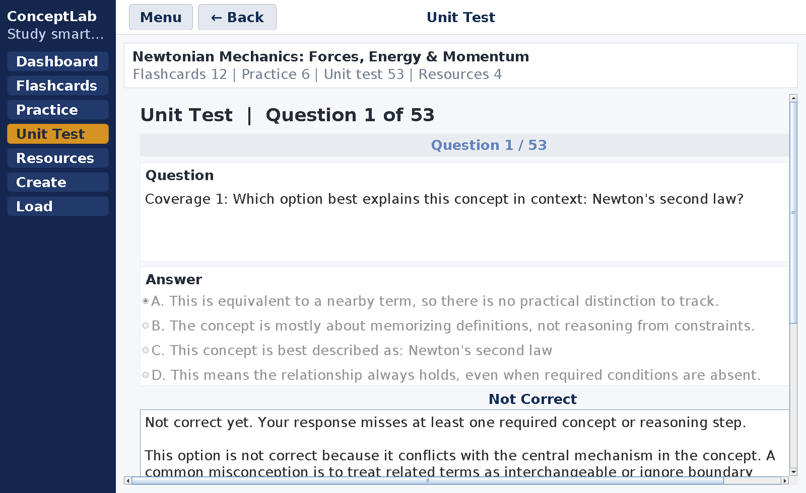

# ConceptLab

**A Java desktop study platform I built to turn course material into application-focused practice, feedback, and reusable StudySets.**

**Sole designer & developer:** Kevin Zhu  
**Stack:** Java · Swing/AWT · Java HTTP Client · Groq API · local file persistence  
**Product testing:** 60+ users and testers, with several classmates and friends adopting ConceptLab for their own studying


*The portfolio screenshots are generated from the current application in CI using an isolated demo StudySet, rather than being manually mocked up.*

## Why I built it

ConceptLab began with a problem I kept seeing around me: students could spend hours reviewing notes and memorizing definitions, then struggle when a test changed the context and asked them to **apply** what they knew.

I wanted to build something that treated that gap as the center of the study process. Instead of stopping at flashcards, ConceptLab turns a student's own material into a structured environment for recall, application, testing, feedback, and review.

> **Design principle:** application matters more than memorization alone, and feedback should be part of learning rather than only the score at the end.

## At a glance

| Area | What ConceptLab does |
| --- | --- |
| **StudySet generation** | Converts notes, topic goals, and custom instructions into structured study material. |
| **Flashcards** | Builds concept-focused cards with stable identities, topic labels, and persistent storage. |
| **Fresh practice** | Generates configurable quizzes with difficulty, MCQ/open-response mix, challenge questions, seen-question avoidance, and strict uniqueness. |
| **Unit tests** | Builds broader, higher-difficulty assessments intended to cover the StudySet rather than repeat practice questions. |
| **Feedback loop** | Evaluates responses, explains mistakes, and surfaces related resources and flashcards. |
| **Reliability** | Validates structured AI output, batches larger requests, retries across key/model combinations, and falls back locally when remote generation fails. |
| **Persistence** | Stores StudySets locally in a versioned text format with validation, escaping, and backward-compatible parsing. |

## From notes to a learning path

A StudySet begins with the student's own source material. The user can also specify learning goals, custom instructions, a target difficulty, and whether challenge-style material should be included.


From there, ConceptLab can build flashcards, unit-test material, and resource links, then generate new practice on demand. The point is not simply to restate the source. The generation rules push toward tasks such as interpreting information, choosing a method, identifying an error, making an inference, or explaining reasoning.

## Designed for application, not repetition

Fresh practice is intentionally configurable rather than fixed. A student can change question count, difficulty, response style, challenge level, whether previously seen prompts should be avoided, and whether correct-answer text must also remain unique.


Under the hood, ConceptLab tracks normalized prompt and answer keys so generated material can be filtered against questions the student has already encountered. Practice and unit-test banks are also kept disjoint by normalized prompt inside the persisted StudySet.

This is one of the clearest ways the original learning philosophy became an engineering requirement: if the goal is application, repeatedly asking the same question in slightly different wording is not enough.

## Feedback is part of the study loop

After a response is submitted, the quiz flow can provide detailed feedback and connect the question back to relevant flashcards and external resources. When remote AI grading is unavailable, questions with known answer keys can still use deterministic local checking rather than silently failing.



I designed this flow so an error leads somewhere useful: **answer → feedback → related concept/resource → try again**.

## Engineering the generation pipeline

Calling an LLM was the easy part. The harder problem was making generated content reliable enough to become real application data.


The current pipeline includes:

- strict JSON output contracts instead of accepting free-form text;
- a dependency-free recursive-descent JSON parser;
- bounded question batches and source-material chunking;
- token-aware output budgeting and truncated-response detection;
- primary/secondary API-key support through environment variables;
- primary/fallback model sequencing and retry handling;
- filtering for malformed questions, duplicate prompts, and duplicate answer text;
- deterministic local generation/checking paths when remote generation is unavailable.

I learned to treat model output as **untrusted external data**, not as a guaranteed function return.

## Data integrity and persistence

The domain models enforce important invariants before data reaches the interface or save file. For example, `Question` validates difficulty, response type, MCQ choice count, normalized choice uniqueness, correct-answer indices, and stable identity. `ResourceLink` only accepts valid HTTP/HTTPS URLs.

I also chose a local-first persistence model instead of adding a database the project did not need. StudySets use a versioned `.clab` text format with sections for metadata, flashcards, practice, unit tests, and resources. The loader verifies declared record counts and retains support for older question formats.

Because user-authored content can contain pipes, backslashes, and newlines, `EscapeUtil` explicitly escapes and restores those characters so content can round-trip without corrupting the file structure.

For the implementation details, see **[`docs/ARCHITECTURE.md`](docs/ARCHITECTURE.md)**.

## Product decisions and iteration

### JavaFX → Swing

My earlier interface work used JavaFX, but framework and build-integration issues repeatedly slowed development. I eventually migrated the desktop interface to Swing and simplified the project structure rather than continuing to invest in an approach that was creating more friction than value.

That decision reinforced a principle that became important throughout ConceptLab: **more complexity does not automatically make a better product.**

### From generating content to generating dependable content

The AI pipeline went through a similar evolution. Malformed responses, output limits, rate limits, repetitive questions, and model availability stopped being isolated bugs once I saw the pattern. I redesigned the system around validation, retry/fallback behavior, batching, token budgets, and uniqueness safeguards.

### Building for users instead of a feature checklist

Early in the project, I tended to treat adding functionality as progress. Putting ConceptLab in front of other students changed the question I asked: **does this actually make studying clearer or more useful?** That shift influenced the configurable practice system, the feedback loop, the focus on application-style questions, and my decision to simplify parts of the implementation when complexity stopped helping the user.

## User testing and adoption

ConceptLab was tested and iterated with **60+ users and testers** during development. Several classmates, friends, and peers moved beyond a one-time test and began using it to support their own studying.

I use that wording deliberately. ConceptLab did not collect production analytics for monthly active users, retention, or measured grade improvements, so I do not claim those metrics. The meaningful outcome was seeing software I had built for a problem around me become useful enough that other students chose to use it themselves.

See **[`docs/USER_TESTING.md`](docs/USER_TESTING.md)** for the evidence standard used in this portfolio.

## Verification

This repository is continuously checked through GitHub Actions. On each relevant push, the workflow:

1. compiles the actual Java application on **JDK 21**;
2. compiles and runs dependency-free core self-tests;
3. checks the public tree for Groq-style credentials;
4. launches the real Swing application inside a virtual display;
5. drives the interface with an isolated demo StudySet;
6. regenerates the screenshots used above.

The self-tests currently cover escaping round-trips, question invariants, resource URL validation, StudySet save/load round-trips, and duplicate protection across practice/unit-test banks.

## Core source structure

- **`Main.java`** — UI construction, navigation, generation pipeline, quiz lifecycle, API calls, and orchestration.
- **`StudySet.java`** — aggregate model, duplicate prevention, versioned persistence, and backward-compatible loading.
- **`Question.java`** — MCQ/short-answer model, invariants, normalized keys, feedback, and answer checking.
- **`Flashcard.java`** — immutable flashcard model with stable identity.
- **`ResourceLink.java` / `ResourceType.java`** — validated external learning resources and categories.
- **`EscapeUtil.java`** — escaping helpers for the custom persistence format.
- **`LoadingScreenFacts.java`** — lightweight content displayed during background generation.
- **`tests/ConceptLabSelfTest.java`** — dependency-free regression/smoke checks for the core model layer.
- **`tools/PortfolioCapture.java`** — reproducible UI driver used to generate the portfolio screenshots from the current application.

## Run locally

### Requirements

- **JDK 21 recommended** (the portfolio CI verifies Java 21)
- A Groq API key for full LLM-backed generation and AI feedback

The interface can launch without an API key, and several generation/checking paths include local fallbacks.

### Configure Groq

ConceptLab reads credentials from environment variables; real keys are never stored in this public repository.

```text
GROQ_API_KEY_PRIMARY=your_key_here
GROQ_API_KEY_SECONDARY=your_optional_secondary_key_here
```

[`.env.example`](.env.example) documents the variable names, but the Java application reads the values from the process environment. Export/set them in your shell or IDE before launching.

### Compile and run

```bash
javac *.java
java Main
```

StudySets are stored under:

```text
~/.conceptlab/sets/
```

### Run the core self-tests

macOS/Linux:

```bash
javac *.java
javac -cp . tests/ConceptLabSelfTest.java
java -ea -cp .:tests ConceptLabSelfTest
```

On Windows, replace the classpath separator `:` with `;`.

## My role

**ConceptLab was independently designed and developed by Kevin Zhu.**

I owned the project end to end: identifying the learning problem, planning the product, designing the data models and interface, implementing persistence and quiz behavior, integrating the LLM pipeline, debugging API and UI failures, iterating on the product, and testing it with other students.

Development tools, including AI-assisted coding tools, were part of the programming workflow, but the product decisions, requirements, integration work, testing, debugging, and final project ownership were mine.

## What I learned

ConceptLab changed the way I think about engineering. The most important lesson was learning to separate **technical possibility** from **product value**.

I learned to replace an approach when it was creating more friction than value, build guardrails around unreliable external behavior, break large problems into smaller systems, and pay attention to what people actually found useful. The project became as much an exercise in product thinking and iteration as it was in programming.

---

**Technical deep dive:** [`docs/ARCHITECTURE.md`](docs/ARCHITECTURE.md)  
**User-testing context:** [`docs/USER_TESTING.md`](docs/USER_TESTING.md)