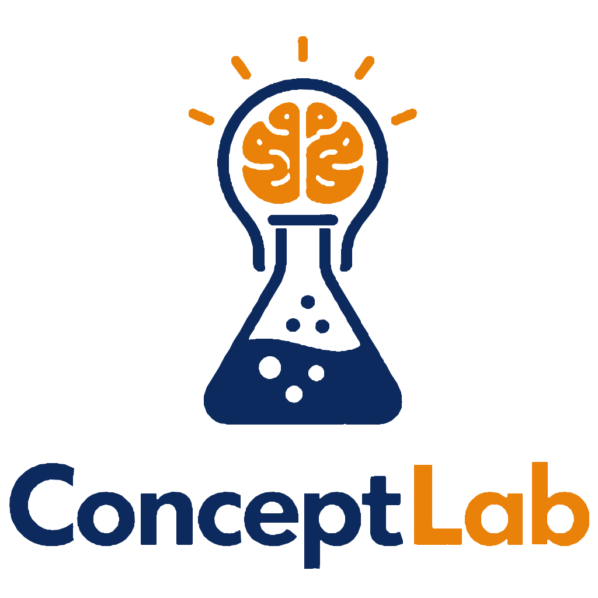
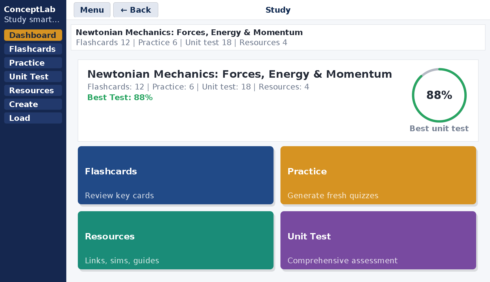
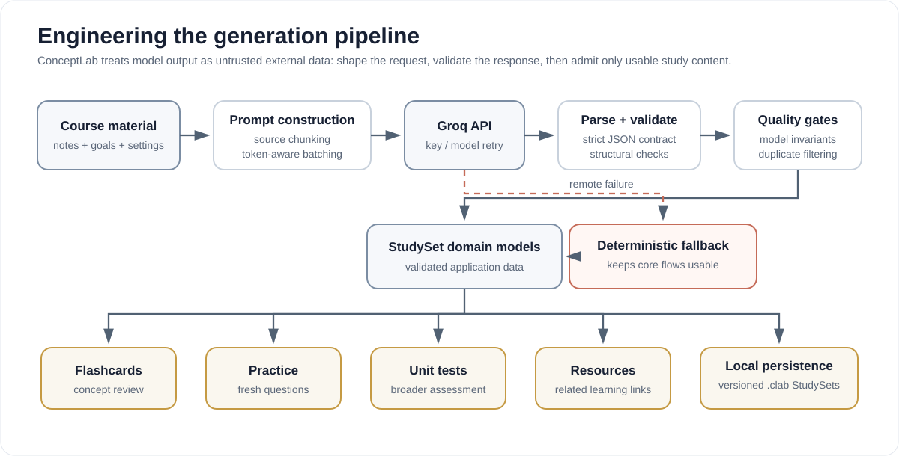
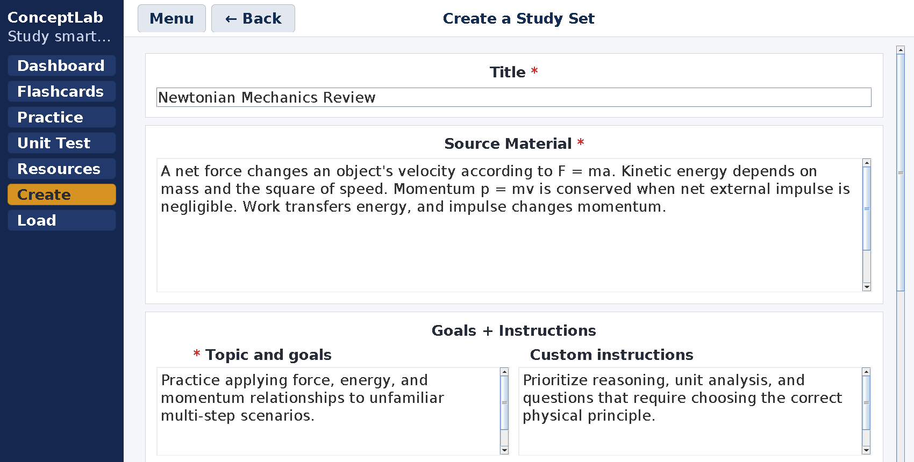
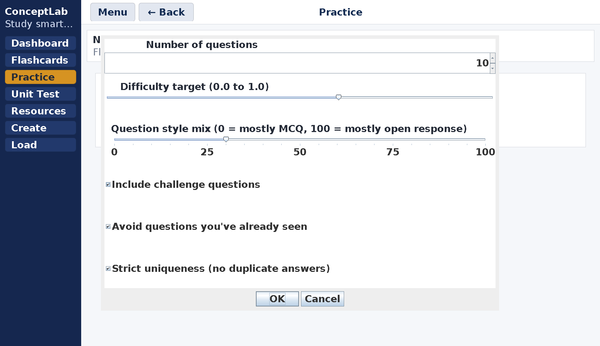

<p align="center">
  
</p>

<p align="center">
  <strong>A Java desktop study platform I built to turn learning material into application-focused practice, feedback, and reusable StudySets.</strong>
</p>

<p align="center">
  Java · Swing/AWT · Java HTTP Client · Groq API · local file persistence
</p>

<p align="center">
  <a href="#why-i-built-it">Why</a> ·
  <a href="#engineering-highlights">Engineering</a> ·
  <a href="#product-workflow">Product</a> ·
  <a href="#development-decisions-and-iteration">Iteration</a> ·
  <a href="#verification-and-reproducibility">Verification</a> ·
  <a href="#run-locally">Run locally</a>
</p>



*This screenshot is generated from the current application in CI using an isolated demo StudySet. It is not a mockup.*

## Why I built it

ConceptLab began with a problem I kept seeing around me: people could spend hours reviewing notes and memorizing definitions, then struggle when a test changed the context and asked them to **apply** what they knew.

I wanted to build something that treated that gap as the center of the study process. Instead of stopping at flashcards, ConceptLab connects source material, practice, testing, feedback, review, and saved progress in one local desktop workflow.

> **Design principle:** application matters more than memorization alone, and feedback should be part of learning rather than only the score at the end.

That principle became both a product decision and an engineering requirement. Fresh questions should not simply repeat familiar wording. Generated content should not enter the application just because an API returned it. A feature should not remain merely because it is technically possible.

## At a glance

| Area | What ConceptLab does |
| --- | --- |
| **StudySet generation** | Converts notes, learning goals, and custom instructions into structured study material. |
| **Flashcards** | Builds concept-focused cards with stable identities, topic labels, and persistent storage. |
| **Fresh practice** | Generates configurable quizzes with difficulty, MCQ/open-response mix, challenge questions, seen-question avoidance, and optional answer uniqueness. |
| **Unit tests** | Builds broader assessments intended to cover the StudySet rather than repeat the practice bank. |
| **Feedback loop** | Evaluates responses, explains mistakes, and connects questions back to related resources and flashcards. |
| **Reliability** | Validates structured AI output, batches larger requests, retries across key/model combinations, and falls back locally when remote generation fails. |
| **Persistence** | Stores StudySets locally in a versioned text format with validation, escaping, and backward-compatible parsing. |

## Engineering highlights

### 1. Treating generated output as untrusted data

Calling an LLM was the easy part. The harder problem was making generated content dependable enough to become real application data.

ConceptLab requests JSON-only output, parses the response, checks structure, converts valid records into domain models, filters malformed or repeated content, and only then admits it into a StudySet. Larger question requests are split into bounded batches, and source material is chunked to reduce output-limit failures.

The API layer also includes primary and secondary environment-based credentials, primary and fallback models, retry handling, token-aware output budgets, truncated-response detection, and deterministic local fallback paths.



The implementation is visible in [`Main.java`](Main.java), while the durable model rules live in [`StudySet.java`](StudySet.java), [`Question.java`](Question.java), [`Flashcard.java`](Flashcard.java), and [`ResourceLink.java`](ResourceLink.java).

The lesson was simple: **I was not just calling an API. I was building a reliable system around an unreliable generator.**

### 2. Turning a learning philosophy into data rules

ConceptLab is designed around application rather than repeated recognition. The generation instructions push toward computation, inference, interpretation, method selection, error diagnosis, and explanation.

That philosophy also appears in the data layer. Practice and unit-test banks are kept disjoint by normalized prompt. The generation flow can block previously seen prompts and, when requested, duplicate correct-answer text. [`Question.java`](Question.java) validates response type, MCQ structure, choice uniqueness, answer indices, difficulty, and stable identity before a question becomes usable application data.

This is one of the project's clearest engineering connections: **if the learning goal is transfer, near-duplicate questions are not good enough.**

### 3. Building local persistence instead of adding infrastructure I did not need

I chose a local-first persistence model rather than adding a database simply because it would make the stack longer.

Each StudySet is stored under the user's home directory in a versioned `.clab` format. [`StudySet.java`](StudySet.java) stores metadata, flashcards, practice questions, unit-test questions, resources, and the best unit-test score. The loader verifies declared section counts and recognizes older question-record formats.

User-authored content can contain pipes, backslashes, and newlines, so [`EscapeUtil.java`](EscapeUtil.java) explicitly escapes and restores reserved characters so content can round-trip without corrupting the file format.

For a deeper technical walkthrough, see [`docs/ARCHITECTURE.md`](docs/ARCHITECTURE.md).

## Product workflow

### From notes to a learning path

A StudySet begins with the user's own source material. The user can also specify learning goals, custom instructions, target difficulty, flashcard count, and whether challenge-style material should be included.



The system can then build flashcards, a broader unit-test bank, and related learning resources. Fresh practice is generated on demand so the user is not limited to one fixed question set.

### Practice is configurable, not fixed

Users can change question count, difficulty, response style, challenge level, whether previously seen prompts should be avoided, and whether correct-answer text should remain unique.



Those settings are not just interface options. They feed directly into prompt construction, generation constraints, duplicate filtering, and the resulting `Question` objects.

### Feedback is part of the loop

A submitted response can lead to correctness feedback, an explanation, a related resource, and related flashcards. For questions with known answer keys, deterministic checking keeps part of the feedback flow usable when remote grading is unavailable.

```text
answer
  -> evaluate
  -> explain
  -> revisit related concept or resource
  -> try again
```

The point is not simply to mark an answer right or wrong. The error should lead somewhere useful.

## Development decisions and iteration

ConceptLab became stronger when I stopped treating added functionality as the same thing as progress.

| Challenge or observation | Decision | What it changed |
| --- | --- | --- |
| JavaFX and embedded-UI integration created dependency and build friction | Move the desktop interface to Swing and simplify the project structure | Reduced framework friction and made the application easier to compile and run |
| Early development rewarded adding features | Shift from feature-first to utility-first design | Kept the product focused on the learning loop instead of accumulating unnecessary controls |
| Detailed analytics would add storage and interface complexity without solving the core problem | Keep only the best unit-test score | Preserved useful progress feedback while keeping the persistence model simple |
| Model responses could be malformed, truncated, repetitive, rate-limited, or unavailable | Add structured contracts, validation, batching, retries, token budgeting, duplicate filtering, and fallback paths | Turned generation from a single API call into a guarded pipeline |
| Testing with other users made clarity and usefulness more important than the feature checklist | Make practice configurable and connect mistakes back to learning material | Shifted the product toward a clearer repeatable study workflow |

The most important design lesson was **more complexity does not automatically make a better product**.

## User testing and adoption

ConceptLab was used or tested by **60+ people during development**, including friends, peers, and other users. Several people moved beyond a one-time test and began using it to support their own learning.

I use that wording deliberately. ConceptLab did not collect production telemetry for monthly active users, retention, session counts, or measured grade improvements, so I do not claim those metrics.

What mattered more was what testing changed. Repeated use reinforced the need for less repetitive practice, configurable quizzes, useful feedback after mistakes, a clearer workflow, and greater reliability when generation failed.

The evidence standard and claim boundaries are documented in [`docs/USER_TESTING.md`](docs/USER_TESTING.md).

## Verification and reproducibility

The public portfolio is continuously checked through [`.github/workflows/verify-and-capture.yml`](.github/workflows/verify-and-capture.yml).

On each relevant push, the workflow:

1. compiles the actual Java application on **JDK 21**;
2. compiles and runs the dependency-free core self-tests in [`tests/ConceptLabSelfTest.java`](tests/ConceptLabSelfTest.java);
3. scans the public tree for Groq-style credentials;
4. launches the real Swing application inside a virtual display;
5. drives the interface using an isolated demo StudySet;
6. regenerates the portfolio screenshots used in this README.

The self-tests currently cover escaping round-trips, question invariants, resource URL validation, StudySet save/load round-trips, and duplicate protection across practice and unit-test banks.

This verification layer exists for the same reason as the generation safeguards: **a portfolio claim is stronger when the repository can reproduce the evidence behind it.**

## Architecture and trade-offs

ConceptLab is a local-first Java desktop application.

The durable model layer is separated into focused classes, but the application and service responsibilities remain concentrated in [`Main.java`](Main.java). `Main` currently handles Swing screen construction, navigation, generation orchestration, API communication, quiz lifecycle, persistence coordination, and several utility concerns.

I do not present that as an ideal final architecture. If this were developed into a longer-term production system, the clearest next step would be to separate networking, generation, storage, and quiz services. For this version, I prioritized stabilizing the complete product and validating the learning workflow over performing a late refactor only to make the repository look more modular.

That trade-off is documented in more detail in [`docs/ARCHITECTURE.md`](docs/ARCHITECTURE.md).

## My role

**ConceptLab was independently designed and developed by Kevin Zhu.**

I owned the project end to end:

- identifying the learning problem and product direction;
- designing the StudySet workflow and desktop interface;
- implementing flashcards, practice, unit tests, feedback, and resource linking;
- building the local persistence format and domain validation;
- integrating and hardening the Groq generation pipeline;
- debugging API, output, persistence, and interface failures;
- testing the product with other users and changing priorities based on what was useful;
- preparing the reproducible public portfolio presentation.

Development tools, including AI-assisted coding tools, were part of the programming workflow. The product decisions, requirements, integration work, testing, debugging, and final project ownership were mine.

## Technology

| Area | Technology and role |
| --- | --- |
| Desktop application | Java 21 |
| Interface | Swing and AWT |
| Networking | Java HTTP Client |
| Generative system | Groq OpenAI-compatible API |
| Structured output | Custom dependency-free JSON parser plus domain validation |
| Persistence | Versioned local `.clab` files |
| Concurrency | `SwingWorker` for background generation and grading flows |
| Verification | GitHub Actions, Java assertions, reproducible UI capture |
| Version control | Git and GitHub |

## Core source structure

- **[`Main.java`](Main.java):** UI construction, navigation, generation pipeline, quiz lifecycle, API calls, and orchestration.
- **[`StudySet.java`](StudySet.java):** aggregate model, duplicate prevention, versioned persistence, and backward-compatible loading.
- **[`Question.java`](Question.java):** MCQ and short-answer model, invariants, normalized keys, feedback, and answer checking.
- **[`Flashcard.java`](Flashcard.java):** immutable flashcard model with stable identity.
- **[`ResourceLink.java`](ResourceLink.java) and [`ResourceType.java`](ResourceType.java):** validated external learning resources and categories.
- **[`EscapeUtil.java`](EscapeUtil.java):** escaping helpers for the custom persistence format.
- **[`LoadingScreenFacts.java`](LoadingScreenFacts.java):** lightweight educational content displayed during background work.
- **[`tests/ConceptLabSelfTest.java`](tests/ConceptLabSelfTest.java):** dependency-free regression and smoke checks for the core model layer.
- **[`tools/PortfolioCapture.java`](tools/PortfolioCapture.java):** reproducible UI driver used by CI to generate the portfolio screenshots from the current application.

## Run locally

### Requirements

- **JDK 21 recommended**
- A Groq API key for full LLM-backed generation and AI feedback

The interface can launch without an API key, and several generation and checking paths include local fallbacks.

### Configure Groq

ConceptLab reads credentials from environment variables. Real keys are never stored in this public repository.

```text
GROQ_API_KEY_PRIMARY=your_key_here
GROQ_API_KEY_SECONDARY=your_optional_secondary_key_here
```

[`.env.example`](.env.example) documents the variable names. The Java application reads values from the process environment, so set them in your shell or IDE before launching.

### Compile and run

```bash
javac *.java
java Main
```

StudySets are stored under:

```text
~/.conceptlab/sets/
```

### Run the core self-tests

macOS/Linux:

```bash
javac *.java
javac -cp . tests/ConceptLabSelfTest.java
java -ea -cp .:tests ConceptLabSelfTest
```

On Windows, replace the classpath separator `:` with `;`.

## What I learned

ConceptLab changed the way I think about engineering.

**Build for the problem, not the feature list.** Adding something is only progress if it makes the product more useful.

**Treat external behavior defensively.** Model output, saved files, and external resources should be validated before the rest of the application trusts them.

**Simplify deliberately.** Replacing a difficult framework, keeping local storage instead of adding a database, and limiting analytics were engineering decisions, not missing ambition.

**Connect technical choices to the user experience.** Duplicate prevention matters because repetitive practice is weak practice. Background work matters because a frozen interface feels broken. Feedback matters because an error should become the next learning step.

The project became as much an exercise in product thinking and iteration as it was in programming.

---

**Technical deep dive:** [`docs/ARCHITECTURE.md`](docs/ARCHITECTURE.md)  
**User-testing context:** [`docs/USER_TESTING.md`](docs/USER_TESTING.md)
