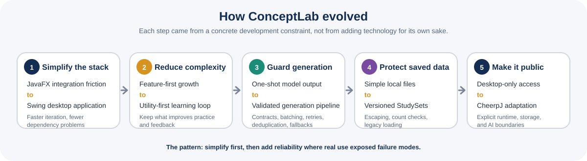

<p align="center">
  
</p>

<p align="center">
  <strong>A Java study platform I built to turn source material into application-focused practice, feedback, and reusable StudySets.</strong>
</p>

<p align="center">
  Java · Swing/AWT · Java HTTP Client · Groq API · local file persistence · CheerpJ · Vercel
</p>

<p align="center">
  Used or tested by <strong>60+ people</strong> during development
</p>

<p align="center">
  <a href="https://conceptlab-browser.vercel.app"><strong>Run ConceptLab in Browser</strong></a>
</p>

<table>
  <tr>
    <td width="50%">
      
    </td>
    <td width="50%">
      
    </td>
  </tr>
  <tr>
    <td align="center"><sub><strong>StudySet:</strong> flashcards, practice, unit assessments, resources, and saved progress in one workflow.</sub></td>
    <td align="center"><sub><strong>Feedback loop:</strong> an incorrect response becomes a correction, a relevant simulation, and related flashcards to review next.</sub></td>
  </tr>
</table>

<p align="center">
  <a href="#product-workflow">Product</a> ·
  <a href="#engineering-highlights">Engineering</a> ·
  <a href="#development-evolution">Evolution</a> ·
  <a href="#user-testing">Testing</a> ·
  <a href="#browser-edition">Browser</a> ·
  <a href="#verification">Verification</a> ·
  <a href="#my-role-and-repository-scope">My role</a>
</p>

## Why I built it

ConceptLab began with a learning problem I kept seeing: reviewing notes and recognizing definitions did not guarantee that someone could apply a concept when the context changed.

I wanted one workflow that connected source material, fresh practice, testing, feedback, related resources, and review. The design principle became simple: **application matters more than memorization alone, and a mistake should lead to the next useful learning step.**

That principle shaped the engineering too. Fresh practice should not collapse into near-duplicate prompts, and generated output should not become application data simply because an API returned it.

## At a glance

| Area | What ConceptLab demonstrates |
| --- | --- |
| **Learning workflow** | Turns source material and learning goals into reusable StudySets with flashcards, fresh practice, unit assessments, feedback, and related resources. |
| **Guarded generation** | Uses structured contracts, parsing, validation, batching, token budgeting, retries, duplicate filtering, provider failover, and deterministic local fallbacks. |
| **Durable local data** | Stores versioned `.clab` StudySets without a database, with escaping, count checks, corruption handling, backward-compatible loading, and cross-bank duplicate protection. |
| **Real iteration** | Outside testing changed practice controls, feedback, workflow, and reliability priorities rather than only adding features. |
| **Public engineering proof** | Runs the real Java/Swing application in a browser and separately verifies the desktop core, browser boundary, deployment artifact, persistence, and live generation path. |
| **My role** | Independently designed and developed the project end to end, from the learning problem and desktop application through browser adaptation and verification. |

## Product workflow

### 1. Build a StudySet from source material

A StudySet starts with the user's own material and can include learning goals, custom instructions, target difficulty, flashcard count, and challenge-style material.

<table>
  <tr>
    <td width="50%">
      
    </td>
    <td width="50%">
      
    </td>
  </tr>
  <tr>
    <td align="center"><sub>Source material, goals, and instructions define what the StudySet should teach.</sub></td>
    <td align="center"><sub>Practice settings feed directly into generation constraints and duplicate handling.</sub></td>
  </tr>
</table>

ConceptLab can build flashcards, a broader unit-assessment bank, related learning resources, and fresh practice generated on demand.

### 2. Practice, adapt, and review

Users can change question count, difficulty, response style, challenge level, whether previously seen prompts should be avoided, and whether correct-answer text should remain unique. Those settings influence prompt construction, generation constraints, duplicate filtering, and which `Question` objects are admitted into the StudySet.

After a response, ConceptLab can show correctness feedback, an explanation, a related resource, and related flashcards. Questions with known answer keys retain deterministic checking paths when remote grading is unavailable. A mistake is therefore not only marked; it becomes the next review step.

<p align="center">
  
</p>
<p align="center">
  <sub><strong>Practice proof:</strong> the public edition runs the Java/Swing workflow directly, including generated questions, saved StudySets, and the same validation rules used by the desktop application.</sub>
</p>

## Engineering highlights

### 1. Building a reliable system around an unreliable generator

Calling a model was the easy part. The harder problem was deciding when generated content was trustworthy enough to become real application data.

ConceptLab requests task-specific structured output, parses it, validates its shape, converts valid records into domain objects, filters malformed or repeated items, and only then admits them into a StudySet. Larger requests are divided into bounded batches, source material is chunked, output budgets account for prompt size, and responses cut off at the token limit are treated as failures rather than partial success.

The generation layer also supports primary and fallback models, optional credential failover, retry handling for transient provider failures, duplicate protection, and deterministic local fallbacks for core study flows.


**The important shift was treating generated output as untrusted external data, not as a trusted internal return value.**

### 2. Turning the learning goal into data rules

ConceptLab biases practice toward computation, inference, interpretation, method selection, error diagnosis, and explanation rather than repeated definition recall.

That goal is enforced below the prompt layer. `StudySet` prevents duplicate IDs and normalized duplicate prompts, and it keeps practice and assessment banks disjoint. `Question` validates response type, MCQ structure, choice uniqueness, answer indices, difficulty, and stable identity at construction time.

If the goal is transfer, a technically valid but nearly repeated question is still a weak result.

### 3. Choosing local persistence instead of unnecessary infrastructure

ConceptLab stores desktop StudySets under the user's home directory in a versioned `.clab` format. Each file records metadata, flashcards, practice questions, unit-assessment questions, resources, and the best assessment score.

Collection sections declare expected record counts, and loading checks those counts against the records actually parsed. Older question formats remain readable after the question model evolved. Because user-authored content can contain pipes, backslashes, and newlines, [`EscapeUtil.java`](EscapeUtil.java) explicitly escapes and restores reserved characters so content can round-trip without corrupting record boundaries.

I chose this local-first design because the product did not need a hosted database. It kept setup smaller while still requiring format versioning, validation, backward compatibility, and corruption handling.

### 4. Keeping long-running work off the Swing event thread

Generation and grading can involve network calls, retries, parsing, and fallback work. ConceptLab runs potentially slow flows through `SwingWorker` behind a cancellable loading experience rather than blocking Swing's event-dispatch thread.

This was a product decision as much as a concurrency decision: a study tool that freezes during its most important operations does not feel dependable, even if the request eventually succeeds.

## Development evolution

The project improved most when I stopped treating additional features as the same thing as progress.

<p align="center">
  
</p>

| Challenge or observation | Decision | Result |
| --- | --- | --- |
| JavaFX and embedded-UI integration created build and dependency friction | Move the desktop interface to Swing and simplify the project structure | Faster iteration and a more dependable local build |
| Early development rewarded feature count | Shift from feature-first to utility-first design | A clearer learning loop with less unnecessary interface complexity |
| Detailed analytics would add storage and UI work without solving the core problem | Keep only the best unit-assessment score | Useful progress feedback without infrastructure for its own sake |
| Model responses could be malformed, repetitive, rate-limited, unavailable, or cut off at an output limit | Add structured contracts, validation, batching, retries, token budgeting, deduplication, and fallbacks | Generation became a guarded pipeline rather than a single API call |
| A public demo risked exposing credentials or creating a second implementation | Keep the Java/Swing sources authoritative, then add explicit browser runtime, storage, and AI boundaries | Immediate browser access without replacing the original project |

Three ideas now define the project: a feature matters only if it improves the real problem, external behavior should be validated before the rest of the system trusts it, and reliability decisions are product decisions because users experience their consequences directly.

## User testing

ConceptLab was used or tested by **60+ people during development**, including friends, peers, and other users. Several went beyond a one-time test and used it to support their own learning.

| What testing exposed | Product or engineering response |
| --- | --- |
| Repetition reduced the value of generated practice | Add normalized prompt tracking, seen-question avoidance, answer-uniqueness controls, and separation between practice and assessment banks |
| Different users wanted different kinds of practice | Make question count, difficulty, response mix, and challenge level configurable |
| A wrong answer alone did not tell the learner what to do next | Connect feedback to explanation, related resources, and related flashcards |
| More controls could make the product harder to use | Remove complexity that did not improve studying and keep the workflow utility-first |

I tracked testing and iteration, not production analytics. I do not claim active-user counts, retention, grade improvement, or controlled learning outcomes. The exact scope and claim boundaries are documented in [`docs/USER_TESTING.md`](docs/USER_TESTING.md).

## Browser edition

ConceptLab began as a Java/Swing desktop application. I added the public browser edition later so the project could be opened immediately without a local Java installation or a visitor-provided API key.

The desktop Java sources remain authoritative. [`browser/build-browser.py`](browser/build-browser.py) applies a small exact-match patch set, compiles a Java 17 artifact, and packages it for **CheerpJ Core 4.3**. The browser adaptation adds three explicit boundaries:

1. **Runtime:** CheerpJ executes the Java/Swing application in the browser.
2. **Persistence:** StudySets use CheerpJ's persistent `/files` filesystem, with a resettable Newtonian Mechanics demo seeded for first-time use.
3. **AI security:** browser generation goes through [`api/conceptlab/ai.js`](api/conceptlab/ai.js), which keeps Groq credentials server-side and accepts only ConceptLab's constrained request contracts.

> **Browser demo note:** This is a public adaptation of the desktop application, not a separate web rewrite. Browser-specific transport and storage behavior are added only at explicit boundaries.

<p align="center">
  <a href="https://conceptlab-browser.vercel.app"><strong>Open the live browser edition</strong></a>
</p>

## Verification

A successful compile is not enough evidence for the claims this project makes. The repository verifies the desktop core, generation policy, browser boundary, and deployed demo separately.

| Layer | What is verified |
| --- | --- |
| **Desktop core** | JDK 21 compilation, model invariants, escaping, StudySet round-trips, duplicate protection, corrupted counts, legacy question loading, malformed persisted records, and resource validation |
| **Generation policy** | Source chunking, token-budget bounds, token/quota failure classification, malformed generated-question filtering, deterministic fallback validity, uniqueness behavior, and offline grading paths |
| **Browser boundary** | Allowed task shapes and models, prompt-size limits, same-origin behavior, response schemas, provider failure handling, key failover, error redaction, and static credential checks |
| **Production browser** | Deployed commit and JAR parity, credential markers, live structured generation, CheerpJ startup in Chromium, seeded StudySet loading, persistence across refresh, Reset Demo behavior, and screenshot evidence |

The main workflows are [`.github/workflows/verify-and-capture.yml`](.github/workflows/verify-and-capture.yml) and [`.github/workflows/production-browser-smoke.yml`](.github/workflows/production-browser-smoke.yml). [`tools/PortfolioCapture.java`](tools/PortfolioCapture.java) drives the real Swing interface to reproduce the desktop captures used in this showcase.

## Architecture and trade-offs

ConceptLab is still fundamentally a local-first Java application. The durable domain layer is separated into focused classes, but UI construction, generation orchestration, API communication, quiz lifecycle, and several service responsibilities remain concentrated in [`Main.java`](Main.java).

I do not present that concentration as ideal. If I continued the project as a larger production system, I would separate networking, generation, storage, and quiz services. For this version, I prioritized stabilizing the complete product and validating the learning workflow over performing a late refactor only to make the repository appear more modular.

| Component | Main responsibility |
| --- | --- |
| [`Main.java`](Main.java) | Swing UI, navigation, generation pipeline, quiz lifecycle, API calls, fallbacks, background work, and orchestration |
| [`StudySet.java`](StudySet.java) | Aggregate model, duplicate prevention, versioned persistence, corruption checks, and backward-compatible loading |
| [`Question.java`](Question.java) | MCQ and short-answer model, structural invariants, normalized keys, feedback, and answer checking |
| [`api/conceptlab/ai.js`](api/conceptlab/ai.js) | Constrained server-side browser bridge, credential isolation, and provider failure handling |
| [`browser/build-browser.py`](browser/build-browser.py) | Reproducible adaptation of canonical Java sources into the CheerpJ browser artifact |

Verification is split across [`tests/ConceptLabSelfTest.java`](tests/ConceptLabSelfTest.java), [`tests/GenerationPolicySelfTest.java`](tests/GenerationPolicySelfTest.java), [`tests/browser-api.test.js`](tests/browser-api.test.js), and [`tests/production-browser-smoke.mjs`](tests/production-browser-smoke.mjs). The deeper implementation walkthrough is in [`docs/ARCHITECTURE.md`](docs/ARCHITECTURE.md).

## Run locally

**JDK 21 is recommended.** A Groq API key enables full model-backed generation and AI feedback, but the interface can launch without one and several flows include local fallbacks.

<details>
<summary><strong>Local setup and verification</strong></summary>

### Configure Groq

ConceptLab reads credentials from environment variables. Real keys are never stored in this public repository.

```text
GROQ_API_KEY_PRIMARY=your_key_here
GROQ_API_KEY_SECONDARY=your_optional_secondary_key_here
```

[`.env.example`](.env.example) documents the variable names. The public browser deployment does not require users to configure them because its credentials remain private Vercel environment variables behind the same-origin server bridge.

### Compile and run

```bash
javac *.java
java Main
```

Desktop StudySets are stored under:

```text
~/.conceptlab/sets/
```

### Run the Java self-tests

macOS/Linux:

```bash
javac *.java
javac -cp . tests/ConceptLabSelfTest.java tests/GenerationPolicySelfTest.java
java -ea -cp .:tests ConceptLabSelfTest
java -ea -cp .:tests GenerationPolicySelfTest
```

On Windows, replace the classpath separator `:` with `;`.

### Run the browser boundary checks

```bash
npm test
npm run verify:static
```

### Rebuild the browser JAR

```bash
python3 browser/build-browser.py --output ConceptLab-browser.jar
python3 browser/normalize-jar.py ConceptLab-browser.jar
```

</details>

## My role and repository scope

**ConceptLab was independently designed and developed by Kevin Zhu.**

I owned the project end to end: the learning problem and product direction, StudySet workflow, Swing interface, flashcards, practice and unit assessments, feedback, resource linking, persistence format, domain validation, Groq integration, reliability work, debugging, user testing, browser adaptation, public deployment, verification, and documentation.

> **Repository history:** This is a curated public release of ConceptLab. Its visible Git history primarily reflects public cleanup, verification, browser deployment work, screenshot preparation, and documentation rather than the complete development timeline.

---

**Technical deep dive:** [`docs/ARCHITECTURE.md`](docs/ARCHITECTURE.md)  
**User testing context:** [`docs/USER_TESTING.md`](docs/USER_TESTING.md)