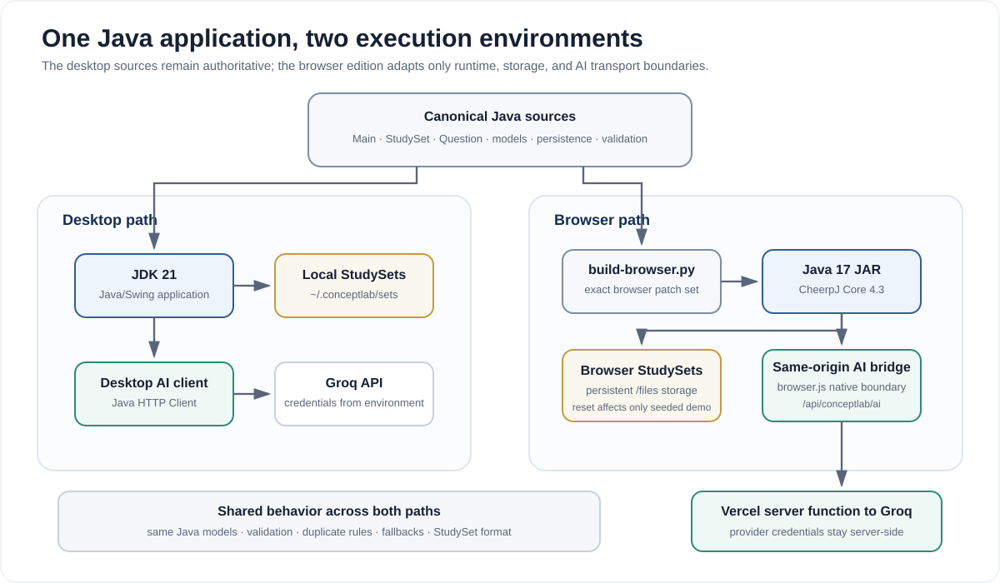

# ConceptLab Architecture

[Back to the README](../README.md)

This is the technical companion to the main ConceptLab README. It keeps implementation detail out of the top-level product story while documenting the boundaries, invariants, failure handling, and trade-offs behind the application.

## Engineering priorities

| Priority | Implementation consequence |
| --- | --- |
| **Validate at boundaries** | Generated JSON, questions, resources, and saved data are checked before the rest of the application trusts them |
| **Keep the product local-first** | StudySets persist without requiring a database or hosted account system |
| **Prefer dependable behavior over feature count** | Retry logic, fallbacks, duplicate prevention, and simplified storage took priority over additional infrastructure |
| **Keep slow work off the interface thread** | Generation and grading run through `SwingWorker` |
| **Keep trade-offs explicit** | Domain rules are separated, while application and service responsibilities remain concentrated in `Main.java` |

## System overview



ConceptLab is fundamentally a Java/Swing desktop application. The same canonical Java sources also produce the public browser edition through an explicit build-time adaptation.

The main application flow is:

1. A user creates or loads a `StudySet`.
2. Source material, learning goals, and optional instructions become generation inputs.
3. ConceptLab attempts model-backed generation using task-specific structured contracts.
4. Responses are parsed, normalized, and converted into `Flashcard`, `Question`, and `ResourceLink` objects.
5. Invalid or repeated content is rejected before it enters a StudySet.
6. Deterministic local fallbacks keep core study flows usable when remote generation fails.
7. StudySets persist in the versioned `.clab` format.

The generation-specific view is in [`media/generation-pipeline.svg`](media/generation-pipeline.svg).

## Browser edition boundary

The browser edition keeps the desktop Java files authoritative. [`browser/build-browser.py`](../browser/build-browser.py) copies those sources into a temporary build, applies an exact-match browser patch set, compiles Java 17 bytecode, and packages the artifact for CheerpJ Core 4.3.

The adaptation changes three boundaries:

- **Runtime:** CheerpJ runs the real Swing application in the browser.
- **Persistence:** `user.home` maps to CheerpJ's persistent `/files` filesystem. The bundled Newtonian Mechanics StudySet is seeded without deleting user-created sets, and Reset Demo affects only the seed.
- **AI transport:** Java calls a registered browser-native function. [`browser.js`](../browser.js) allows only the same-origin `/api/conceptlab/ai` endpoint, and [`api/conceptlab/ai.js`](../api/conceptlab/ai.js) adds the Groq credential server-side.

The browser transport also has an explicit timeout, rejects unexpected endpoints, and never embeds provider credentials in the Java artifact or browser bundle.

Each browser launch passes a unique token to Java. Java writes that token only after storage setup and Swing initialization complete, giving the production smoke test a stronger readiness signal than a page-level loading message.

## Major components

### [`Main.java`](../Main.java)

`Main` is the application entry point and largest orchestration component. It currently owns:

- Swing screen construction and navigation;
- current UI and application state;
- StudySet creation;
- practice and unit-assessment generation;
- quiz lifecycle and scoring;
- feedback rendering;
- Groq requests and fallback sequencing;
- resource validation;
- persistence coordination;
- asynchronous loading through `SwingWorker`.

This concentration reflects the project's development history rather than an architecture I would choose for a larger production system.

### [`StudySet.java`](../StudySet.java)

`StudySet` is the persistent aggregate root. It stores the stable set ID, title, flashcards, practice bank, unit-assessment bank, resources, and best unit-assessment percentage.

It also enforces cross-bank integrity. Practice and assessment questions cannot reuse IDs or normalized prompts, and the two banks remain disjoint by normalized prompt.

### [`Question.java`](../Question.java)

`Question` supports `MCQ` and `SHORT_ANSWER` modes and rejects structurally invalid state at construction time.

MCQs require exactly four non-blank, normalized-distinct choices and a valid correct index. Difficulty must remain within `[0, 1]`.

Known-key short answers use conservative deterministic matching when remote grading is unavailable. After normalization, an exact key matches, and a longer response may match when it contains the complete stored key. A partial fragment is not accepted simply because it appears inside the key. [`QuestionAnswerPolicySelfTest.java`](../tests/QuestionAnswerPolicySelfTest.java) protects this behavior.

Normalized prompt and answer keys are also used for duplicate filtering.

### [`Flashcard.java`](../Flashcard.java)

`Flashcard` is an immutable model containing a stable ID, topic, front, and back. Blank required fields are rejected at construction time.

### [`ResourceLink.java`](../ResourceLink.java) and [`ResourceType.java`](../ResourceType.java)

Resources have stable IDs and semantic categories such as simulation, article, video, practice, reference, or interactive content. `ResourceLink` permits only HTTP/HTTPS URLs with a non-empty host, and the application performs additional validation before retaining generated links.

### [`EscapeUtil.java`](../EscapeUtil.java)

The `.clab` format is pipe-delimited, but user content can contain pipes, backslashes, and newlines. `EscapeUtil` provides explicit encode/decode rules and delimiter-aware splitting so content can survive a storage round trip without corrupting record boundaries.

## Generation pipeline

### Input shaping

StudySet generation uses title, source material, learning goals, custom instructions, flashcard count, difficulty, and challenge preference. Source and goals can also be reduced into content facets for deterministic fallback generation.

### Structured output contracts

ConceptLab requests JSON-only output using task-specific schemas for flashcards, resources, questions, and answer evaluation. The model is treated as an unreliable external service whose output must satisfy application rules before use.

### Application-focused practice

Question prompts bias practice toward behaviors such as computation, inference, interpretation, method selection, error diagnosis, and explanation rather than definition recall alone.

Users can tune difficulty, open-response mix, challenge questions, seen-question avoidance, and answer uniqueness.

### Batching and token control

Large requests are bounded rather than sent as one unplanned prompt. ConceptLab:

- splits source material into bounded chunks;
- generates questions in small batches;
- calculates output-token allowances from estimated prompt size;
- reserves a safety margin;
- treats output-limit truncation as failure.

### Retry and fallback sequence

Desktop credentials come from:

```text
GROQ_API_KEY_PRIMARY
GROQ_API_KEY_SECONDARY
```

The desktop layer can try primary and fallback models across configured credentials, with retry handling for transient failures and rate limits. Real secrets remain outside the repository.

If remote generation ultimately fails, ConceptLab can create deterministic flashcards, questions, and fallback resources from extracted facets. Known-answer questions retain local checking paths. Remote-only short answers without a stored key fail closed: the application explains that automatic grading is unavailable rather than inventing correctness.

### Parse and validate

A successful HTTP status is not enough. ConceptLab also checks for blank content, malformed envelopes, malformed JSON, truncated completions, invalid question structures, duplicate prompts, and duplicate correct-answer text where strict uniqueness is enabled.

Only records that survive those checks become application data.

## Persistence design

The current file signature is:

```text
CONCEPTLAB_STUDYSET|v4
```

A StudySet file contains:

```text
META
FLASHCARDS
PRACTICE
UNITTEST
RESOURCES
```

Collection sections declare expected record counts, and loading compares those declarations with the records actually parsed. The loader also recognizes older question-record formats so StudySets remain readable after the question model evolved to support multiple response types.

## UI and concurrency

ConceptLab uses Swing and AWT. Important screens include start/create/load, StudySet dashboard, flashcard review, practice settings, resources, and the shared quiz/unit-assessment interface.

Potentially slow work runs through `SwingWorker` behind a cancellable loading experience rather than blocking the event-dispatch thread.

After a submitted response, the interface can surface correctness and feedback, a related external resource, and related flashcards selected for review.

## Major design evolution

### JavaFX to Swing

The earlier interface used JavaFX. Build and integration friction became significant enough that I migrated to Swing and simplified the project layout. The choice was about stability and iteration speed for this project, not a claim that Swing is universally better.

### Feature-first to utility-first

Earlier development made it easy to treat added functionality as progress. The project became more focused when I started asking whether each feature improved the actual learning workflow.

Progress tracking is one example. ConceptLab stores the best unit-assessment percentage rather than building detailed analytics infrastructure that did not solve the central product problem.

### Free-form AI to guarded AI

The generation system evolved from requesting content to treating model output as untrusted external data. Batching, schema rules, retries, token budgeting, parsing, structural validation, deduplication, and fallbacks came from concrete failure modes rather than from adding technical complexity for appearance.

## Current architecture trade-off

The largest remaining trade-off is [`Main.java`](../Main.java). It contains both UI responsibilities and substantial service/integration logic.

For a longer-term production version, the clearest extraction order would be:

1. `GroqClient` for HTTP and retry behavior;
2. `GenerationService` for prompt construction, parsing, and generation policy;
3. `StorageService` for StudySet discovery, save, and load coordination;
4. `QuizService` for assessment generation and answer evaluation;
5. a standalone JSON parser utility.

For this release, stabilizing the complete product and validating the learning workflow took priority over a late structural rewrite. The trade-off is documented because it is part of the engineering history, not something the portfolio should hide.
